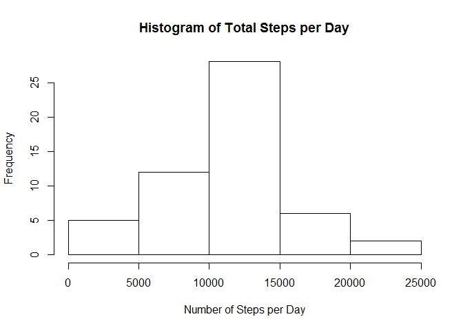
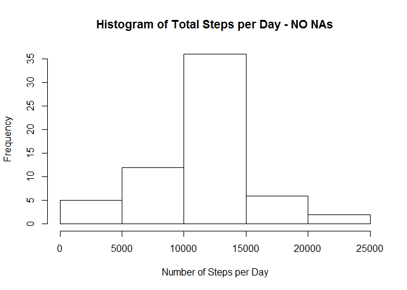
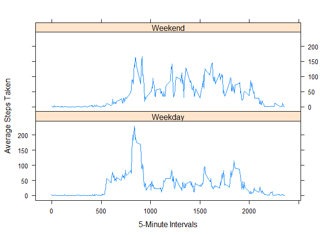

# Peer_Assessment1
Pratyusa  
March 13, 2016  

## Loading and Preprocessing the data
#### File Path set and dataset unzipped:

```r
filesPath <- "C:/Users/Jhilmil/Documents/Reproducible Research/RepData_PeerAssessment1"
setwd(filesPath)
library(lattice)
fileUrl <- "https://d396qusza40orc.cloudfront.net/repdata%2Fdata%2Factivity.zip"
download.file(fileUrl,destfile="./activitydata.zip")

unzip(zipfile="./activitydata.zip")
activity <- read.csv("activity.csv",sep = ',', header = TRUE)
str(activity)
```

```
## 'data.frame':	17568 obs. of  3 variables:
##  $ steps   : int  NA NA NA NA NA NA NA NA NA NA ...
##  $ date    : Factor w/ 61 levels "2012-10-01","2012-10-02",..: 1 1 1 1 1 1 1 1 1 1 ...
##  $ interval: int  0 5 10 15 20 25 30 35 40 45 ...
```

```r
summary(activity)
```

```
##      steps                date          interval     
##  Min.   :  0.00   2012-10-01:  288   Min.   :   0.0  
##  1st Qu.:  0.00   2012-10-02:  288   1st Qu.: 588.8  
##  Median :  0.00   2012-10-03:  288   Median :1177.5  
##  Mean   : 37.38   2012-10-04:  288   Mean   :1177.5  
##  3rd Qu.: 12.00   2012-10-05:  288   3rd Qu.:1766.2  
##  Max.   :806.00   2012-10-06:  288   Max.   :2355.0  
##  NA's   :2304     (Other)   :15840
```


## What is mean total number of steps taken per day?
#### Calculated the total number of steps:


```r
stepsperday <- aggregate(steps ~ date, data=activity, FUN = sum, na.rm=TRUE)
```

#### Created a histogram of the total number of steps taken each day:


```r
hist(stepsperday$steps, main="Histogram of Total Steps per Day", xlab = "Number of Steps per Day")
```



#### Calculated the mean and median of the total number of steps taken per day:


```r
mean(stepsperday$steps)
```

```
## [1] 10766.19
```

```r
median(stepsperday$steps)
```

```
## [1] 10765
```


## What is the average daily activity pattern?
#### Made a time series plot of the 5-minute interval (x-axis) and the average number of steps taken, averaged across all days (y-axis):


```r
activityperinterval <- aggregate(steps ~ interval, data=activity, FUN=mean)
plot(activityperinterval, type = "l")
```


#### Calculated the 5-minute interval, on average across all the days in the dataset, that contains the maximum number of steps:


```r
activityperinterval$interval[which.max(activityperinterval$steps)]
```

```
## [1] 835
```


## Imputing missing values
#### Calculated the total number of missing values in the dataset:


```r
sum(is.na(activity))
```

```
## [1] 2304
```

#### Filled in missing values in the dataset:


```r
activityimputed <- activity
activitymean <- aggregate(steps ~ interval, data=activity, FUN=mean)
a <- c()
for (i in 1:nrow(activityimputed)) {
  if (is.na(activityimputed[i,"steps"])) {
    temp <- activityimputed[i,"interval"]
    activityimputed[i, "steps"] <- subset(activitymean, interval == temp)$steps
   
  }
}
```

#### Created new dataset including the filled in missing values:


```r
dailysteps <- aggregate(steps ~ date, data=activityimputed, FUN=sum)
```

#### Made a histogram of the total number of steps taken each day:


```r
hist(dailysteps$steps, main="Histogram of Total Steps per Day - NO NAs", xlab = "Number of Steps per Day")
```



#### Calculated the mean and median total number of steps taken per day:


```r
mean(dailysteps$steps)
```

```
## [1] 10766.19
```

```r
median(dailysteps$steps)
```

```
## [1] 10766.19
```

### Do these values differ from the estimates from the first part of the assignment?
#### The mean remains the same; the median shifts up slightly.

### What is the impact of imputing missing data on the estimates of the total daily number of steps?
#### The number of days with the average number of steps increased.


## Are there differences in activity patterns between weekdays and weekends?
#### Created a new factor variable in the dataset with two levels – “weekday” and “weekend” - indicating whether a given date is a weekday or weekend day:


```r
activityimputed$day <- weekdays(as.Date(activityimputed$date))
daytype <- vector()
for (i in 1:nrow(activityimputed)) {
  if (activityimputed$day[i] == "Saturday") {
    daytype[i] <- "Weekend"
  } else if (activityimputed$day[i] == "Sunday") {
    daytype[i] <- "Weekend"
  } else {
    daytype[i] <- "Weekday"
  }
}
activityimputed$daytype <- daytype
activityimputed$daytype <- factor(activityimputed$daytype)

stepsperday <- aggregate(steps ~ interval + daytype, data = activityimputed, mean)
names(stepsperday) <- c("interval", "daytype", "steps")
```

#### Made a panel plot containing a time series plot of the 5-minute interval (x-axis) and the average number of steps taken, averaged across all weekday days or weekend days (y-axis):


```r
xyplot(steps ~ interval | factor(daytype),
       data=stepsperday,
       type = 'l',
       layout = c(1, 2),
       xlab="5-Minute Intervals",
       ylab="Average Steps Taken")
```



